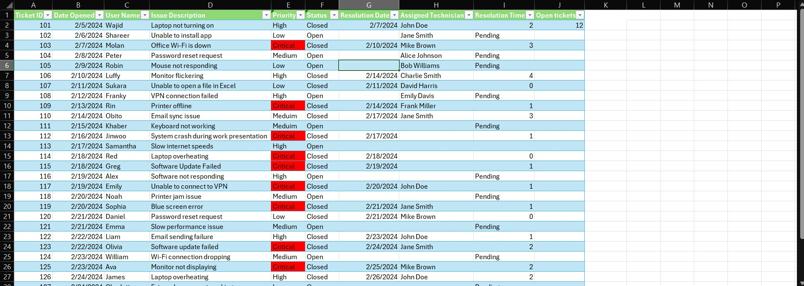

# help-ticket
# Helpdesk Ticket Tracker (Excel)

A professional and easy-to-use Helpdesk Ticket Tracker built entirely in **Microsoft Excel**. This tool is designed for small IT teams, freelance technicians, or anyone needing a lightweight system to track support requests without expensive software.

## 📊 Features

- Unique Ticket ID for each issue
- Date tracking for ticket opening and resolution
- User name and issue description fields
- Priority levels: Low, Medium, High, Critical (highlighted in red for visibility)
- Ticket status: Open or Closed
- Assigned Technician column for accountability
- Auto-calculated Resolution Time (in days)
- "Pending" label for unresolved tickets
- Open Tickets tracker (column J) for workload insights
- Conditional formatting for clear visual cues
- Filterable column headers for easy sorting

## 🖼 Screenshot

## ⚙️ How It Works

- Each row in the tracker represents a single support request.
- The **Priority** column uses conditional formatting to highlight critical tickets in red.
- The **Status** and **Resolution Date** columns are used to calculate **Resolution Time**, or display "Pending" if unresolved.
- The **Open tickets** column (J) counts ongoing tickets per technician or user for workload management.
- The spreadsheet is formatted with filterable headers, allowing the user to quickly sort or search by any column (e.g., by Priority, Technician, or Status).

## 💡 Use Cases

This Excel tracker is ideal for:
- Small businesses managing internal IT issues
- Freelance IT support specialists
- Students learning IT service management
- Anyone needing a clean, offline helpdesk ticketing system

## 📁 File

You can download and try it from this repository:
- `TicketTracker.xlsx`

---

> ✅ **No macros or external plugins required. Fully built using Excel formulas and formatting.**

